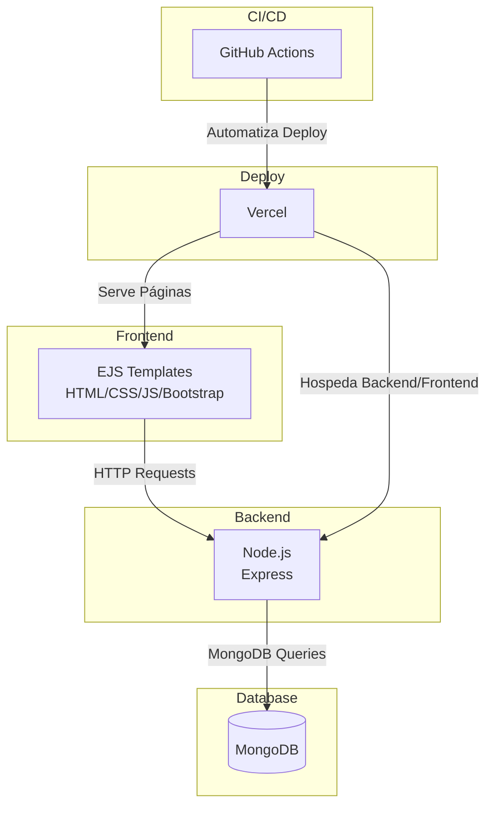

# 🏗️ Visão de Arquitetura – Projeto Find Workers

## 🎯 Visão Geral

O projeto **Find Workers** é uma aplicação web monolítica que conecta trabalhadores autônomos a pessoas que precisam de pequenos serviços (ex.: jardinagem, manutenção doméstica, etc.). A arquitetura foi desenhada para ser simples, escalável e de fácil manutenção.

---

## 🧩 Principais Componentes

- **Frontend (EJS + HTML/CSS/JavaScript)**  
  - Renderização server-side com EJS.
  - Interações simples com JS puro e Bootstrap para estilização.

- **Backend (Node.js + Express)**  
  - Responsável por todas as regras de negócio.
  - Gerencia rotas, autenticação e comunicação com o banco.

- **Banco de Dados (MongoDB)**  
  - Armazena informações dos usuários (clientes/trabalhadores), serviços oferecidos e solicitações de trabalho.

- **CI/CD (GitHub Actions)**  
  - Automatiza testes e deploy contínuo para o ambiente de demonstração.

- **Hospedagem (Vercel)**  
  - Executa o servidor backend e serve as páginas web.

---

## 🔁 Fluxo de Dados

1. O usuário acessa o site e realiza o login.
2. **Trabalhadores** cadastram serviços disponíveis no sistema.
3. **Clientes** visualizam os serviços e fazem solicitações (requests).
4. O backend processa as solicitações, salva no banco e notifica os trabalhadores.
5. Trabalhadores podem aceitar/rejeitar as solicitações.
6. O status das solicitações é atualizado conforme o progresso do trabalho.
7. Toda interação é persistida no MongoDB e renderizada no frontend.

---

## 🧰 Tecnologias Utilizadas

| Camada        | Tecnologia                    |
|---------------|-------------------------------|
| Frontend      | EJS, HTML5, CSS3, Bootstrap   |
| Backend       | Node.js, Express              |
| Banco de Dados| MongoDB (local/Atlas)         |
| CI/CD         | GitHub Actions                |
| Deploy        | Vercel                        |
| Versionamento | Git + GitHub                  |

---

## 📐 Diagrama da Arquitetura (sugestão visual)

> 

---

Última atualização: 08/07/2025